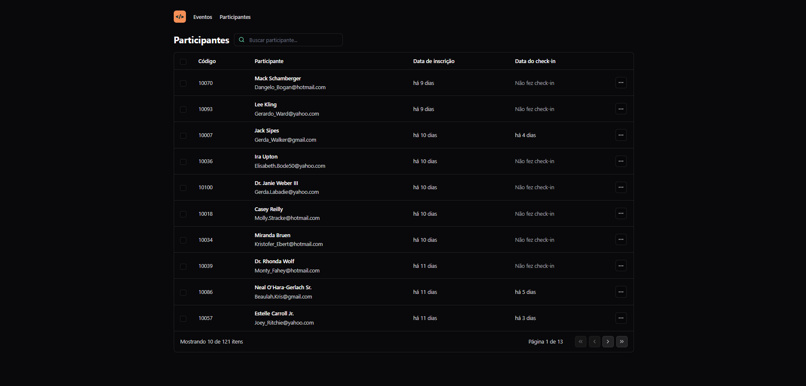

# **NLW Unite (React.js)**

Projeto construído durante Imersão da NLW Unite de React.js da Rocketseat com o objetivo de desenvolver um sistema de gestão de participantes em eventos.

[**🔗 Clique aqui para acessar**](https://github.com/bamarcheti/pass-in-web)

## **🛠 Tecnologias**

> ### _Front-end_
>
>       
>
> ### _Bibliotecas e Ferramentas_
>
>      
>
> ### _Pacotes e extensões_
>
> - dayjs
> - lucide-react
> - tailwind-merge
> - @tailwindcss/forms
> - autoprefixer

## **✨ Como executar**

- **_[README-install](./README-install.md)_**

## **💛 Contato**

